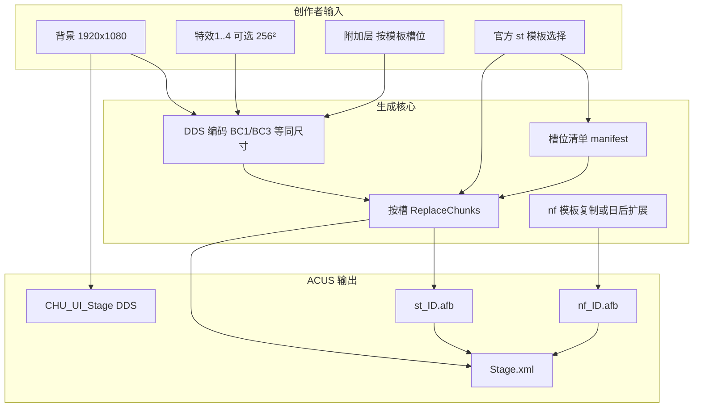

# 多动态组件 Stage 生成 — 技术分析

> **文档性质**：调研与设计前置分析（**不含代码实现**）。  
> **依据**：本地 `A001/stage/` 官方样本、`chuni_eventer_desktop` 现有 Stage 管线、[muautils](https://github.com/Foahh/muautils) 开源实现、仓库内既有 Stage/AFB 文档。  
> **修订**：2026-05-24

---

## 1. 背景与目标

### 1.1 现状

Chuni-Eventer 已支持「**单张 1920×1080 背景图 → Stage 目录**」：

- 生成 `CHU_UI_Stage_*.dds` 预览（裁切 + 轨道叠加图）
- 调用 `mua convert_stage` 基于 **`st_dummy.afb`（2 个 DDS 槽）** 写出 `st_*.afb`
- 复制 `nf_dummy.afb` → `nf_*.afb`
- 写出 `Stage.xml`（元数据）

该路径在游玩体验上接近「静态全屏背景 + 默认特效板」，与 A001 里曲目绑定 Stage（如 `stage026801`、`stage027201`）相比，**缺少多层贴图、滚动条带、独立特效层等「动态组件」**。

### 1.2 目标（产品语义）

在**不声称完全复刻官方演出脚本**的前提下，将自制 Stage 能力升级为：

| 层级 | 用户可感知能力 | 技术含义 |
|------|----------------|----------|
| L1 | 全屏背景可换 | 已有（`convert_stage` 槽 0） |
| L2 | 最多 4 张特效图合成一块 512×512 特效板 | muautils 已支持（`-f1`～`-f4`，槽 1） |
| L3 | 多张**独立尺寸**贴图层（256²、512²、2048×128 等）可替换 | 需**官方模板 + 按槽替换**，超出当前 `convert_stage` |
| L4 | 图层运动、时间轴、显隐 | 可能在 AFB 非 DDS 区或引擎侧；**本阶段不承诺** |

本文聚焦 **L2～L3 的可行工程路径**，并标明 L4 的未知边界。

---

## 2. A001 官方 Stage 数据模型

### 2.1 目录与文件（`A001/stage/`）

每个 Stage 一个目录 `stage{6位ID}/`，典型文件：

| 文件 | `Stage.xml` 字段 | 作用 |
|------|------------------|------|
| `Stage.xml` | — | 元数据、引用路径 |
| `st_{5位}.afb` | `baseFile/path` | 游玩主背景/演出贴图容器 |
| `nf_{5位}.afb` | `notesFieldFile/path` | 谱面判定区域相关资源 |
| `CHU_UI_Stage_{5位}.dds` | `image/path`（可选） | UI 列表预览，**不参与** `st_*.afb 烘焙` |
| （少见） | `objectFile/path` | 样本中均为空 |

**样本**（本地 A001）：

- 简单/旧版：`stage000011`（`st_00011.afb` ≈ 9.4 MB，9 个 DDS 槽）
- 中等动态：`stage026801`（ぷにるはかわいいスライム，`st_26801.afb` ≈ 8.6 MB，7 槽）
- 高复杂：`stage027201`（メダリスト，`st_27201.afb` ≈ 11.7 MB，16 槽）

`Stage.xml` 结构见 [stage创建和管理实现方案](../活动与玩法机制/stage创建和管理实现方案.md)；`stage026801` 与 `stage027201` 均含完整的 `notesFieldFile` / `baseFile` / `image` 字段，`objectFile` 为空。

### 2.2 `st_*.afb` 与 `nf_*.afb` 的分工

| 容器 | 内嵌 `DDS ` 块（muautils 模型） | 备注 |
|------|--------------------------------|------|
| `st_*.afb` | **有**（7～16 块/样本） | 主体视觉资源；非 DDS 区占比约 0.4%～0.8%（索引/头部，见 §4） |
| `nf_*.afb` | **无**（扫描无 `DDS ` 魔数） | ~30 KB 二进制；格式独立于 `st_`；当前工具链**整文件复制** dummy |

结论：**「多动态组件」主要指 `st_*.afb` 内多 DDS 槽**；`nf_*.afb` 若要做自定义，需单独逆向或沿用官方/ dummy 模板。

### 2.3 与 Music / Reward 的引用

Stage 不是孤立资源：

- `Music.xml` → `stageName`
- `Reward`（type=13）→ `stage/stageName`
- 地图通过 Reward 间接发放 Stage

新建/替换 Stage 时必须保持 **ID 与 `Stage.xml` 一致**，并注意 [stage创建和管理实现方案](../活动与玩法机制/stage创建和管理实现方案.md) 中的引用扫描与删除保护。

---

## 3. muautils（`mua`）能力边界

### 3.1 相关子命令

来源：[muautils README](https://github.com/Foahh/muautils) / `src/cli/app.cpp` / `src/image/image.cpp`。

```text
mua extract_dds  -s <.afb> -d <目录>     # 按 DDS 槽导出 _0001.dds …
mua convert_stage -b <背景> -s <模板.st> -d <输出.st> [-f1..-f4 <特效图>]
mua image_check  -s <图片>               # 输入校验
```

### 3.2 `convert_stage` 实际行为（源码级）

1. `LocateDdsChunks`：在模板中按 `DDS ` 头 + `POF0` 辅助定界找出**全部**槽位（顺序扫描）。
2. 仅生成 **2 段**新 DDS 字节流：
   - 背景：`1920×1080` → **BC1（DXT1）**
   - 特效：最多 4 张 `256×256`（空槽透明）拼成 **2×2 → 512×512** → **BC3（DXT5）**
3. `ReplaceChunks`：**按槽下标**写入；`replacements.size()` **必须 ≥ 槽位数**，否则抛错。

因此 **`convert_stage` 仅适用于「恰好 2 个 DDS 槽」的模板**（如 bundled `st_dummy.afb`）。对 `st_26801.afb`（7 槽）或 `st_00011.afb`（9 槽）**不能直接作为 `-s` 模板**——会在 `ReplaceChunks` 因替换数组长度不足而失败。

`ReplaceChunks` 已支持「按槽 `optional`：有值则替换、无值则保留原块」，但 **`ConvertStage` 未暴露「只换第 0 槽、其余保留」的 API**；这是扩展 muautils 或自研替换器的首要切入点。

### 3.3 `extract_dds` 与块边界

- 块结束位置：下一 `DDS ` 与 `POF0` 的较小者（见 `chunk.cpp` `LocateChunks`）。
- 导出命名：`<afb 主名>_0001.dds`、`_0002.dds` …
- **变长替换**会改变文件总长度；若非 DDS 区含偏移表，存在**破坏演出的风险**，需游戏内回归。

更完整的 AFB 说明见 [CHUNITHM_Stage_AFB格式与高级场景实现说明](./CHUNITHM_Stage_AFB格式与高级场景实现说明.md)。

---

## 4. 官方样本实测：DDS 槽位画像

以下数据由本地脚本扫描 `DDS ` 头并解析 DDS 宽高得到（BC 格式以 FourCC/flags 为准，未逐项校验）。

### 4.1 对比表

| 样本 | 文件大小 | DDS 槽数 | 非 DDS 字节 | 典型槽类型（按槽序） |
|------|----------|----------|-------------|----------------------|
| `st_dummy.afb`（自制模板） | 1.31 MB | **2** | ~9.8 KB | ① 1920×1080 ② 512×512 |
| `st_26801.afb` | 9.05 MB | **7** | ~12.4 KB | ① 1920×1080 ②③④ 256×256 ⑤⑥ 2048×128 ⑦ 128×128 |
| `st_27201.afb` | 12.21 MB | **16** | ~46.4 KB | 多个 512×512、256×256、1024×1024，末槽 1920×1080 |
| `st_00011.afb` | 9.88 MB | **9** | ~77.4 KB | 多种条带/小图；**主背景在第 7 槽**而非第 1 槽 |

### 4.2 对「动态组件」的归纳（贴图层）

| 组件类型 | 典型尺寸 | 在样本中的角色推测 | 自制可替换性 |
|----------|----------|-------------------|--------------|
| 主背景 | 1920×1080 | 全屏静态底图 | **高**（与 `convert_stage -b` 一致，但需注意槽位**下标**） |
| 特效拼板 | 512×512（BC3） | 四格 256 特效 atlas | **高**（`-f1`～`-f4`，仅当该槽在模板中为 512² 时） |
| 独立特效层 | 256×256 × N | 分图层动画/粒子 | **中**（需按槽生成**同尺寸同格式** DDS） |
| 滚动/条带层 | 2048×128 × 2 | 横向滚动 UV 类条带（常见于 MV 风舞台） | **中**（需保留尺寸；内容可换图） |
| 中大贴图 | 512² / 1024² | 角色/大物件层 | **中～低**（槽多、格式需对齐） |
| 小图标 | 128×128 | UI/装饰 | **中** |
| 非 DDS 区 | 12 KB～77 KB | 可能含块表、对齐、引擎私有数据 | **不建议手改**；换槽时尽量保持总长或整段复制 |

**重要**：`st_00011` 说明**不能假设「第 1 个 DDS 槽 = 背景」**；多槽替换必须以 **`extract_dds` 序号 + 尺寸校验** 建立槽位语义表，而不能硬编码槽 0 = 背景。

### 4.3 `stage026801` 作为「中等复杂度」模板的意义

- 7 槽、结构比 `st_27201`（16 槽）更易维护，又比 `st_dummy`（2 槽）更接近官方演出。
- 含 **2048×128** 双条带，是区分「单图 Stage」与「轻动态 Stage」的关键层；保留条带仅换 1920 背景 + 256 特效，即可在**低风险**下获得更接近官方的观感。
- `objectFile` 为空 → 动态**不依赖**额外 object 文件（至少对本曲）。

---

## 5. Chuni-Eventer 现状与缺口

### 5.1 已有实现（摘要）

| 模块 | 行为 |
|------|------|
| `stage_from_image.py` | 1920 图 → 预览 DDS；可选 `build_stage_afb_from_image` |
| `stage_afb_convert.py` | `mua convert_stage`，`fx_paths=None`；模板优先 `st_dummy` |
| `ui/stage_add_dialog.py` | 「图片转背景」入口 |

### 5.2 与 PenguinTools 的差异

[PenguinTools 图片转 Stage AFB 实现解析](./PenguinTools图片转StageAFB实现解析.md)：`StageConverter` 同样使用 `st_dummy` + 可选 `-f1`～`-f4`，并复制 `nf_dummy`。

本仓库 **`convert_stage` 未传特效图**，等价于「仅背景 + 模板自带第二槽」。

### 5.3 已识别的数据层缺口（实现多动态前需修）

1. **`Stage.xml` 未写入 `notesFieldFile` / `baseFile`**  
   `build_stage_afb_from_image` 会生成 `nf_*.afb`、`st_*.afb`，但 `create_stage_from_image` 当前 XML **缺少** 这两项路径。游戏若严格读 XML，可能导致 Stage **无法加载演出容器**（与 A001 `stage026801` 结构不一致）。  
   → 多动态方案应将此列为 **P0 数据完整性** 项（实现阶段，非本文范围）。

2. **模板固定为 2 槽 dummy**  
   无法保留官方 7/16 槽中的条带与小层。

3. **无 `extract_dds` 封装**  
   无法从官方 Stage **拆解 → 编辑 → 按槽回写** 的工作流。

4. **无槽位元数据**  
   UI/配置层缺少「槽序号、尺寸、是否必填、预览缩略图」模型。

---

## 6. 目标架构：多动态 Stage 生成

### 6.1 概念模型



**StageTemplateManifest**（建议，配置或 JSON）示例字段：

```json
{
  "template_id": "stage026801",
  "source_afb": "A001/stage/stage026801/st_26801.afb",
  "slots": [
    {"index": 1, "role": "background", "width": 1920, "height": 1080, "compression": "bc1", "required": true},
    {"index": 2, "role": "fx_layer", "width": 256, "height": 256, "compression": "bc3", "required": false},
    {"index": 5, "role": "scroll_strip", "width": 2048, "height": 128, "compression": "bc3", "preserve": true}
  ]
}
```

`preserve: true` 表示用户未提供素材时**保留模板原块**（实现 L3 的「只换背景+部分特效」）。

### 6.2 三条技术路线

| 路线 | 做法 | 优点 | 缺点 | 推荐阶段 |
|------|------|------|------|----------|
| **R1 扩展 muautils** | PR/Fork：`convert_stage` 增加 `--slot N` / manifest 文件；或 `replace_dds` 子命令 | 与 PenguinTools 同源、C++ 性能好 | 依赖外部发版；LGPL 静态链接合规 | 中期 |
| **R2 Python 复刻 ReplaceChunks** | 按 `chunk.cpp` 逻辑实现定位+替换；编码复用 `mua convert_jacket` 或 Pillow+texconv | 迭代快、与桌面端集成易 | 需严格单测对齐 muautils；变长风险自担 | **短期首选** |
| **R3 仅 CLI 编排** | `extract_dds` → 用户 Photoshop → 外部工具拼回 | 零开发替换核心 | 无法产品化 | 调研/专家用户 |

**建议**：**R2 为主、R1 并行**——桌面端先落地 manifest + Python 替换；稳定后将 manifest 格式贡献给 [muautils](https://github.com/Foahh/muautils)。

### 6.3 分阶段交付（与产品风险）

#### Phase A — 数据正确 + 双槽增强（低风险）

- 修复 `Stage.xml` 的 `notesFieldFile` / `baseFile` 写入。
- UI 支持 **4 张 256² 特效图**，传入 `stage_afb_convert._run_mua_convert_stage(..., fx_paths=[...])`。
- 文档化：输入仍须 1920 背景；第二槽为 512 拼板。

**验收**：游戏内可玩；与当前 dummy 行为兼容；特效可见变化。

#### Phase B — 官方模板「选择性换皮」（中风险）

- 内置 2～3 套 **manifest**（推荐默认：`stage026801` / `st_26801`）。
- 实现 **按槽 optional 替换**（背景必换；256 特效可选；2048×128 **默认保留**）。
- 提供 `extract_dds` 包装：导出槽位预览图供创作参考。
- 输出文件名遵循 `st_{id:05d}.afb`，**从模板复制** nf（或继续 nf_dummy）。

**验收**：对比 `stage026801` 原版，替换背景后条带动画仍正常；无崩溃、无明显 UV 错乱。

#### Phase C — 多槽编辑器（中高风险）

- UI：槽位列表、缩略图、尺寸提示、导入 PNG、一键编码回写。
- 支持 **用户自选模板**（从 game_root/A001 浏览 `st_*.afb`，自动 `extract_dds` 生成 manifest 草稿）。
- 变长替换开关默认 **关闭**；高级用户开启并签署「需自测」提示。

#### Phase D — 真·时间轴动态（高风险，调研项）

- 对 `st_*.afb` 非 DDS 区做 hex/结构 diff（`st_26801` vs `st_dummy`）。
- 追踪社区逆向（Criware/ADX、SEGA 容器等）是否已有 AFB 时间轴文档。
- `objectFile` 非空样本的收集与分析。

**不在 Phase A～C 承诺范围内。**

---

## 7. 编码与约束规范（实现期应遵守）

| 项目 | 约束 |
|------|------|
| 主背景 | 1920×1080；BC1；与 `convert_stage` 一致 |
| 四格特效 | 各 256×256 → 合成 512×512 BC3；空槽透明 |
| 任意槽替换 | **宽高、DXT 格式、mip 链**须与模板该槽导出 DDS 一致；优先「同字节长」替换 |
| 输入图 | 走 `mua image_check` 或同等校验（色彩、alpha） |
| 模板来源 | 仅使用**有权使用的** A001/自有资源；内置分发需考虑版权（建议用户本机 `game_root` 指向） |
| 工具依赖 | `mua.exe`（[muautils](https://github.com/Foahh/muautils)）；可选扩展 `extract_dds` |
| 合规 | muautils 为 **LGPL-2.1**；静态链接分发需保留 NOTICE / 源码要约（见 muautils `legal/`） |

---

## 8. 测试与验证策略

1. **单元级**：对 `st_dummy`、`st_26801` 做 extract → replace(slot0) → extract 对比槽 0 尺寸与魔数；槽 1～N 字节级一致（未替换时）。
2. **游戏内**：选 3 首曲分别绑定新 Stage，覆盖：仅背景、背景+fx、官方模板保留条带。
3. **回归**：Music/Reward 引用 ID 不变；删除保护扫描仍通过。
4. **失败预期**：对 `st_00011` 类「背景不在槽 0」的模板，manifest 必须标 `background_slot_index: 7`，否则禁止一键「换背景」。

---

## 9. 风险登记

| 风险 | 影响 | 缓解 |
|------|------|------|
| 变长 DDS 破坏非 DDS 索引 | 演出花屏/崩溃 | 默认同长替换；整文件复制模板 |
| 槽位语义猜错 | 换错层 | manifest 人工标注 + extract 预览 |
| `nf_*.afb` 非 DDS 格式未知 | 判定区异常 | Phase A～B 继续 dummy 复制 |
| 模板版权 | 法律/分发 | 不内置官方 afb；引导用户本地 A001 |
| `convert_stage` 与多槽模板不兼容 | 误用失败 | UI 禁用不匹配套路；文档明示 |
| XML 缺 base/nf 路径 | 游戏不加载 | Phase A 修复 |

---

## 10. 与现有文档的关系

| 文档 | 关系 |
|------|------|
| [CHUNITHM_Stage_AFB格式与高级场景实现说明](./CHUNITHM_Stage_AFB格式与高级场景实现说明.md) | AFB/`mua` 总览；本文在其上补充 **A001 实测槽位** 与 **产品化分阶段** |
| [PenguinTools图片转StageAFB实现解析](./PenguinTools图片转StageAFB实现解析.md) | 调用链；多动态需在 Manipulate 层之上增加 manifest |
| [stage创建和管理实现方案](../活动与玩法机制/stage创建和管理实现方案.md) | XML/引用/管理页；多动态不改变引用模型 |
| [A001更新包文件结构说明](./A001更新包文件结构说明.md) | `stage/` 在 A001 顶层的位置 |

---

## 11. 结论与建议优先级

1. **「多动态」在数据层 ≈ `st_*.afb` 内多 DDS 槽 + 少量非 DDS 元数据**；`stage026801`（7 槽）是比 `st_dummy`（2 槽）更合适的进阶模板。  
2. **[muautils](https://github.com/Foahh/muautils) 的 `convert_stage` 只覆盖 2 槽**；要实现 L3，必须 **按槽替换**（扩展 muautils 或 Python 复刻 `ReplaceChunks`）。  
3. **`-f1`～`-f4` 应作为 Phase A 的快速收益**，成本低且与官方 512 特效板一致。  
4. **2048×128 等条带层宜默认保留**，是「像官方」的关键；全替换为单背景会明显退步。  
5. **实现前先修 `Stage.xml` 的 afb 路径字段**，否则后续多槽工程无法在游戏内验证。  

**推荐实施顺序**：Phase A（XML + 特效四图）→ Phase B（`stage026801` manifest + 选择性替换）→ Phase C（槽位 UI）→ Phase D（非 DDS / 时间轴调研）。

---

## 附录 A：`stage026801` 槽位清单（实测）

| 槽 # | 偏移（约） | 尺寸 | 建议角色 |
|------|------------|------|----------|
| 1 | 12448 | 1920×1080 | 主背景 |
| 2 | 8306976 | 256×256 | 特效/物件 1 |
| 3 | 8372640 | 256×256 | 特效/物件 2 |
| 4 | 8438304 | 256×256 | 特效/物件 3 |
| 5 | 8503968 | 2048×128 | 滚动条带 A |
| 6 | 8766240 | 2048×128 | 滚动条带 B |
| 7 | 9028512 | 128×128 | 小装饰 |

## 附录 B：`st_dummy` vs `convert_stage` 参数映射

| convert_stage 输出 | 对应 dummy 槽 | 编码 |
|--------------------|---------------|------|
| `-b` 背景 | 槽 1 | BC1 1920×1080 |
| `-f1..-f4` 合成 | 槽 2 | BC3 512×512 |

## 附录 C：命令速查

```text
mua extract_dds -s A001/stage/stage026801/st_26801.afb -d ./out_layers
mua convert_stage -b bg.png -s chuni_eventer_desktop/data/st_dummy.afb -d st_out.afb -f1 a.png -f2 b.png
mua image_check -s bg.png
```

---

*文档结束。实现阶段请在本文件基础上另开「实现说明」或 PR 描述，并回写实测结果到附录。*
